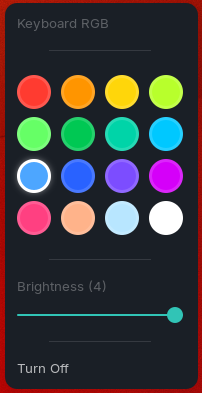

# ALG RGB GNOME Extension

Control the RGB keyboard on Acer ALG laptops directly from the GNOME top panel.



## What it does

This extension adds a native status indicator to GNOME Shell and uses the `alg-rgb` CLI in the background to apply lighting changes. It is designed to make keyboard color switching fast, visible, and easy to reach without opening a terminal.

## Features

- Top panel indicator with a compact popup menu
- 16 preset colors arranged in a grid
- Brightness control with levels from 0 to 4
- One-click turn-off action
- Simple command-based integration with `alg-rgb`

## Requirements

- GNOME Shell 45 or newer
- [`alg-rgb`](https://github.com/24kaushik/alg-cli) installed and available on your `PATH`
- An Acer ALG laptop with RGB keyboard support

## Installation

1. Copy this extension folder into your GNOME extensions directory.
2. Make sure the extension UUID matches the folder or packaging setup you are using.
3. Restart GNOME Shell or log out and back in.
4. Enable the extension from GNOME Extensions or Extension Manager.

## Usage

Open the top panel indicator and choose a color from the grid. Use the brightness slider to adjust intensity, or select Turn Off to disable the keyboard lighting.

## How it works

The extension launches commands in the form of:

```bash
alg-rgb <color> <brightness>
```

For example, selecting white at brightness 4 will call `alg-rgb white 4`, while Turn Off calls `alg-rgb off`.

## Troubleshooting

- If nothing happens when you select a color, confirm that `alg-rgb` runs correctly from a terminal.
- If the extension does not appear in GNOME Shell, verify the folder name and UUID in `metadata.json`.
- If brightness changes are ignored, check that your device supports the configured brightness range.

## Screenshot

The screenshot below shows the extension menu in GNOME Shell:


---
<center>Made with love and laziness by Kaushik ❤️</center>
